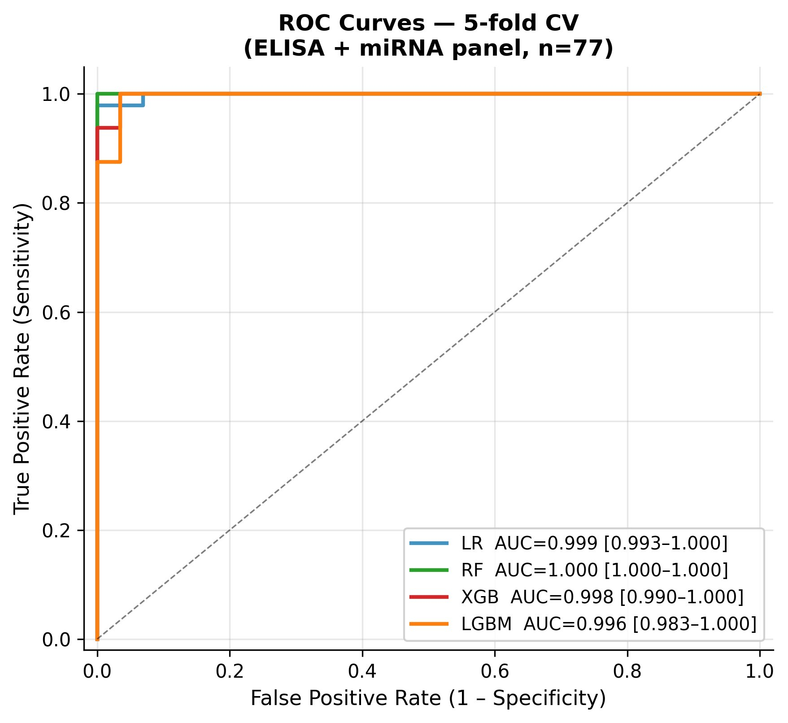
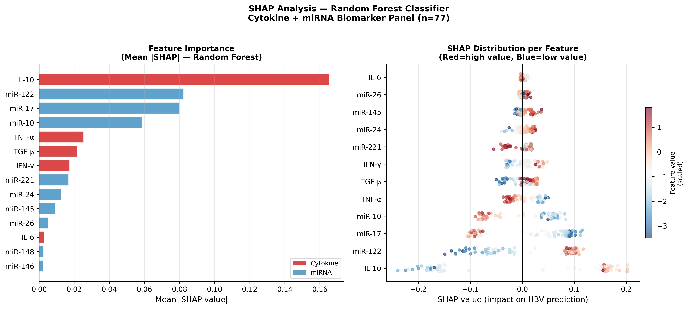
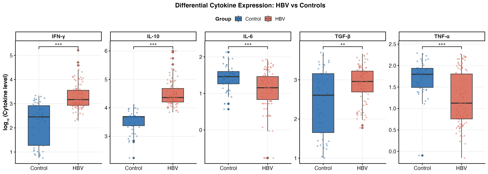

# Cytokine–miRNA Interaction Networks and Host Genetic Variation as Predictive Biomarkers of Immune Modulation in Chronic Hepatitis B

> **An Integrated Molecular Profiling and Machine Learning Study**

[](https://opensource.org/licenses/MIT)
[](https://www.r-project.org/)
[](https://www.python.org/)
[](https://colab.research.google.com/)

---

## 📋 Overview

This repository contains the complete reproducible analysis pipeline for the manuscript:

**"Cytokine–microRNA Interaction Networks and Host Genetic Variation as Predictive Biomarkers of Immune Modulation in Chronic Hepatitis B: An Integrated Molecular Profiling and Machine Learning Study"**

**Authors:** Ibraheem M. Aly¹, Roba M. Talaat¹  
**Affiliation:** ¹Molecular Biology Department, Genetic Engineering and Biotechnology Research Institute (GEBRI), University of Sadat City, Egypt

---

## 🧬 Study Design

This work integrates **three molecular layers** in an Egyptian HBV cohort (n = 237):

| Layer | Assay | n features |
|-------|-------|------------|
| Cytokine protein levels | ELISA | 5 (IL-10, TGF-β, IL-6, TNF-α, IFN-γ) |
| miRNA expression | qRT-PCR | 12 miRNAs |
| Host genetic variation | SNP genotyping (PCR-SSP/RFLP) | 11 SNPs across 5 cytokine genes |

**Machine Learning classifiers evaluated:**
- Logistic Regression (LR)
- Random Forest (RF)
- XGBoost (XGB)
- LightGBM (LGBM)

---

## 📁 Repository Structure

```
HBV-Immune-Profiling-ML/
│
├── README.md
├── LICENSE
├── .gitignore
│
├── data/
│   ├── README.md                  ← Data description & cohort summary
│   └── cohort_summary.csv         ← Cohort sizes (no patient-level data)
│
├── R/
│   ├── 01_data_preparation.R      ← Data loading, cleaning, cohort definition
│   ├── 02_statistical_analysis.R  ← Mann-Whitney, Chi-square, HWE, FDR
│   ├── 03_visualization.R         ← Figures 1–7 (boxplots, PCA, heatmaps, SNP)
│   └── requirements.R             ← Package installation & version info
│
├── Python/
│   ├── HBV_ML_Pipeline.ipynb      ← Full Google Colab notebook
│   ├── HBV_ML_Pipeline.py         ← Python script version
│   └── requirements.txt           ← pip dependencies
│
├── figures/                       ← All publication figures (PNG + PDF)
│   ├── Figure1_ELISA_boxplots.png
│   ├── Figure2_miRNA_boxplots.png
│   ├── Figure3_PCA.png
│   ├── Figure7_SNP_Genotypes.png
│   ├── FigureML_A_ROC_curves.png
│   ├── FigureML_B_Confusion_matrices.png
│   ├── FigureML_C_Model_comparison.png
│   ├── FigureML_D_Feature_comparison.png
│   ├── FigureML_E_SHAP.png
│   └── FigureML_F_XGB_importance.png
│
└── results/                       ← Statistical outputs & ML metrics
    ├── stats_ELISA.csv
    ├── stats_miRNA.csv
    ├── stats_SNP.csv
    ├── stats_HWE.csv
    ├── ML_summary_table_final.csv
    ├── ML_feature_comparison.csv
    └── SHAP_feature_importance.csv
```

---

## 🚀 How to Reproduce

### Step 1 — R Statistical Analysis

```r
# Install required packages
source("R/requirements.R")

# Run analysis pipeline
source("R/01_data_preparation.R")   # → defines cohorts A–E
source("R/02_statistical_analysis.R") # → Mann-Whitney, Chi-square, HWE
source("R/03_visualization.R")       # → Figures 1–7 + CSV outputs
```

> ⚠️ **Data note:** Place your dataset CSV in the `data/` folder.  
> The raw patient-level data is not publicly available due to IRB privacy restrictions.  
> Contact the corresponding author for data access requests.

### Step 2 — Machine Learning (Google Colab)

1. Upload `cohort_D_ELISA_miRNA_ml_ready.csv` and `cohort_E_ALL_ml_ready.csv` (outputs from Step 1) to Colab
2. Open `Python/HBV_ML_Pipeline.ipynb` in [Google Colab](https://colab.research.google.com/)
3. Run all cells sequentially

**Or run locally:**
```bash
pip install -r Python/requirements.txt
python Python/HBV_ML_Pipeline.py
```

---

## 📊 Key Results

### Differential Expression
| Feature | Direction in HBV | FDR p-value |
|---------|-----------------|-------------|
| IL-10 | ↑ Elevated | < 0.001 |
| IFN-γ | ↑ Elevated | < 0.001 |
| TGF-β | ↑ Elevated | 0.006 |
| IL-6 | ↓ Reduced | < 0.001 |
| TNF-α | ↓ Reduced | < 0.001 |
| miR-122 | ↑ Upregulated | < 0.001 |
| miR-17 | ↓ Downregulated | < 0.001 |
| miR-10 | ↓ Downregulated | < 0.001 |

### Machine Learning Performance (5-fold CV, n = 77)

| Model | AUC | 95% CI | F1 | Accuracy |
|-------|-----|--------|----|----------|
| LR | 0.999 | [0.993–1.000] | 0.972 | 97.4% |
| **RF** | **1.000** | **[1.000–1.000]** | **1.000** | **100%** |
| XGB | 0.998 | [0.990–1.000] | 0.972 | 97.4% |
| LGBM | 0.996 | [0.983–1.000] | 0.986 | 98.7% |

### Top SHAP Biomarkers (RF + XGB consensus)
1. **IL-10** (mean |SHAP| = 0.165)
2. **miR-122** (0.082)
3. **miR-17** (0.080)
4. **miR-10** (0.059)

---

## 🖼️ Selected Figures

### ROC Curves


### SHAP Analysis


### Differential Cytokine Expression


---

## 🔬 Analytical Cohorts

| Cohort | Features | n (total) | Controls | HBV |
|--------|----------|-----------|----------|-----|
| A | SNP genotyping | 200 | 104 | 96 |
| B | ELISA cytokines | 143 | 46 | 97 |
| C | miRNA | 98 | 48 | 50 |
| D | ELISA + miRNA | 77 | 29 | 48 |
| E | All features | 73 | 29 | 44 |

---

## 🛠️ Software & Dependencies

### R (version 4.3.x)
| Package | Version | Purpose |
|---------|---------|---------|
| tidyverse | 2.0.0 | Data manipulation & ggplot2 |
| ggpubr | 0.6.0 | Publication-ready plots |
| FactoMineR | 2.9 | PCA |
| corrplot | 0.92 | Correlation heatmaps |
| pheatmap | 1.0.12 | Hierarchical clustering |
| HardyWeinberg | 1.7.5 | HWE testing |
| patchwork | 1.2.0 | Figure composition |
| rstatix | 0.7.2 | Statistical tests |

### Python
| Package | Version | Purpose |
|---------|---------|---------|
| scikit-learn | 1.4.x | ML pipeline, CV, metrics |
| xgboost | 2.0.x | XGBoost classifier |
| lightgbm | 4.3.x | LightGBM classifier |
| shap | 0.44.x | SHAP interpretability |
| pandas | 2.x | Data manipulation |
| numpy | 1.x | Numerical computation |
| matplotlib | 3.x | Plotting |
| seaborn | 0.13.x | Statistical visualization |

---

## 📚 Citation

If you use this code or data in your research, please cite:

```bibtex
@article{aly2024hbv,
  title   = {Cytokine--microRNA Interaction Networks and Host Genetic Variation 
             as Predictive Biomarkers of Immune Modulation in Chronic Hepatitis B: 
             An Integrated Molecular Profiling and Machine Learning Study},
  author  = {Aly, Ibraheem M. and Talaat, Roba M.},
  journal = {[Journal Name]},
  year    = {2025},
  doi     = {[DOI]}
}
```

---

## 🔗 Related Publications from Our Group

This study continues a research programme on cytokine genetics in Egyptian HBV cohorts:

1. Talaat RM et al. IL-10 gene polymorphism & HBV. *Biochem Genet.* 2014.
2. Talaat RM et al. TGF-β polymorphism & HBV. *Hindawi.* 2013.
3. Abdelkhalek MS, Talaat RM et al. TNF-α polymorphism & HBV. *Hum Immunol.* 2017.
4. Dondeti MF, Talaat RM et al. IFN-γ polymorphism & HBV. *J Appl Biomed.* 2022.
5. Talaat RM et al. miRNA-100 & MALAT1 SNPs & HBV. *Int J Epigenetics.* 2023.
6. El-Shanawany RM, Talaat RM et al. TNF-α & miR-122 in liver disease. *BMC Pediatr.* 2024.

---

## 📄 License

This project is licensed under the MIT License — see [LICENSE](LICENSE) for details.

---

## 📬 Contact

**Ibraheem M. Aly**  
M.Sc. Student, Bioinformatics Department  
GEBRI, University of Sadat City, Egypt  
GitHub: [@IbraheemMustafaAly](https://github.com/IbraheemMustafaAly)

**Prof. Roba M. Talaat** (Corresponding Author)  
Molecular Biology Department, GEBRI  
University of Sadat City, Egypt
